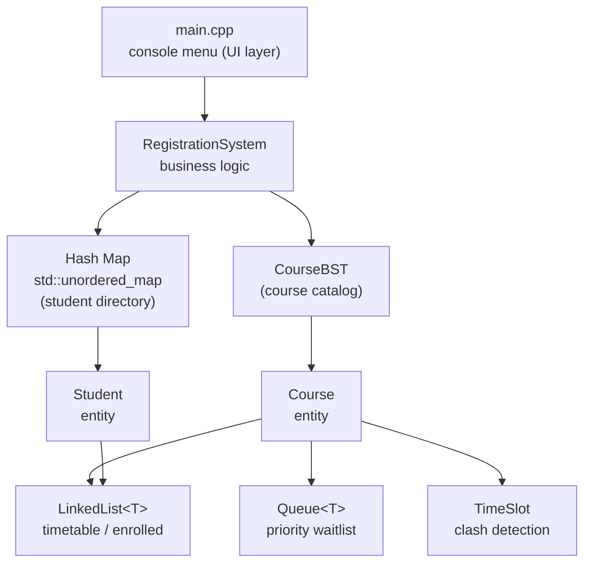

# University Course Registration System

> A console-based course registration engine written in modern C++, built around four classic data structures — a **hash map**, a **binary search tree**, a **priority queue**, and a **singly linked list** — with the tree, queue, and list implemented from scratch. The emphasis throughout is on picking the right structure for each job and understanding its time/space trade-offs.

🔗 **Live demo:** [https://imahmadzohaib.github.io/University-Course-Registration-System/](https://imahmadzohaib.github.io/University-Course-Registration-System/)


---

## Table of Contents

- [Overview](#overview)
- [Features](#features)
- [Data Structures at a Glance](#data-structures-at-a-glance)
- [Architecture](#architecture)
- [Project Structure](#project-structure)
- [Build & Run](#build--run)
- [Usage](#usage)
- [Complexity Analysis](#complexity-analysis)
- [Optimization & Design Highlights](#optimization--design-highlights)
- [Data Export](#data-export)
- [Limitations & Future Work](#limitations--future-work)
- [Acknowledgements](#acknowledgements)

---

## Overview

Course registration is one of the busiest activities on any campus: thousands of students compete for a limited number of seats, popular classes fill within minutes, waiting lists form, timetables clash, and the administration still needs fast, reliable reports. Behind every smooth registration experience is a careful choice of data structures.

This project models that problem as a menu-driven C++ program. Each subsystem is powered by the data structure best suited to it — an `unordered_map` for constant-time student lookup, a binary search tree for a self-sorting course catalog, a priority queue for a fair waiting list, and linked lists for dynamically growing timetables and enrollment lists. The domain logic (capacity limits, clash prevention, seniority-based waitlisting, and reporting) is layered cleanly on top of these building blocks.

The codebase is deliberately small, header-only, and dependency-free — it compiles with a single command and relies only on the C++ standard library for I/O, strings, and the hash map container.

---

## Features

**Core**

- Add students and courses, each with duplicate-key protection.
- Register for and drop courses while respecting seat **capacity**.
- Automatic **waiting list** when a course is full, with automatic **promotion** the moment a seat frees up.
- **Timetable clash prevention** — a student cannot register for two overlapping classes.
- **Course cancellation** that notifies every enrolled and waitlisted student, then removes the course.
- Sorted course listings produced directly from the BST via in-order traversal (no separate sort step).

**Advanced**

- **Seniority priority** on the waiting list: a final-year student is promoted ahead of a junior, even if the junior joined the queue first.
- **Course feedback** (ratings 1–5, restricted to enrolled students) and a **popularity ranking** report.
- **Export** of the full catalog to **CSV** and **JSON**.
- One-tap **sample data** seeding for quick exploration.

---

## Data Structures at a Glance

| Structure | Implementation | Role in the system | Why it fits |
|-----------|----------------|--------------------|-------------|
| **Hash Map** | `std::unordered_map` (standard library) | Student directory: `studentId → Student*` | Average **O(1)** lookup, insert, and existence checks |
| **Binary Search Tree** | `CourseBST` — *from scratch* | Course catalog keyed by `courseId` | Fast search **and** free sorted listings via in-order traversal |
| **Priority Queue** | `Queue<T>` — *from scratch* | Per-course waiting list | Fair FIFO ordering with seniority override; **O(1)** dequeue |
| **Singly Linked List** | `LinkedList<T>` — *from scratch* | Student timetables and per-course enrollment lists | Grows/shrinks dynamically; **O(1)** append via a tail pointer |

The generic containers (`LinkedList`, `Queue`, `CourseBST`) know nothing about courses or students — the domain classes are built *on top* of them.

---

## Architecture

The program is split into small, single-purpose headers. Generic data structures sit at the bottom, domain entities use them, a controller wires everything together, and `main.cpp` provides the interface.



*Generic building blocks (bottom) → domain entities → controller → UI (top). Each layer depends only on the one beneath it, which keeps every piece easy to test and reason about.*

---

## Project Structure

```text
CourseRegistrationSystem/
├── src/
│   ├── main.cpp              # Menu-driven console interface
│   ├── RegistrationSystem.h  # Controller: all business logic & reports
│   ├── CourseBST.h           # Binary search tree — course catalog (owns Course objects)
│   ├── Queue.h               # Priority-capable FIFO queue — waitlist
│   ├── LinkedList.h          # Generic singly linked list (timetables, enrollment)
│   ├── Course.h              # Course entity (capacity, ratings, waitlist)
│   ├── Student.h             # Student entity + TimetableEntry
│   └── TimeSlot.h            # Time slot value type + clash() helper
└── docs/
    └── Project_Documentation.docx   # Full written project report
```

All data-structure logic lives in header files as templates, so `main.cpp` is the only translation unit that needs to be compiled.

---

## Build & Run

**Requirements:** any C++11-capable compiler (`g++` 4.8+ or `clang++`).

```bash
# from the project root
g++ -std=c++11 src/main.cpp -o registration
./registration
```

On Windows (MinGW) the same command produces `registration.exe`; run it with `.\registration.exe`. Because the data structures are header-only, no separate compilation or linking step is required.

Once running, choose option **14** to load sample data, then explore the menu.

---

## Usage

The program presents a numbered menu:

```text
==================== MAIN MENU ====================
  1.  Add student
  2.  Add course
  3.  Register for a course
  4.  Drop a course
  5.  Cancel a course (notify everyone)
  6.  View a student's timetable
  7.  List available courses (free seats)
  8.  List all courses
  9.  View course details (enrolled + waitlist)
 10.  Give course feedback (rating 1-5)
 11.  Popularity report
 12.  Export courses to CSV
 13.  Export courses to JSON
 14.  Load sample data
  0.  Exit
==================================================
```

### Sample session — capacity, seniority priority, and auto-promotion

`CS101` has a capacity of **2**. Watch what happens when a fourth student registers, and note that **Sara (year 4)** overtakes **Usman (year 1)** on the waitlist despite joining after him:

```text
Registered Ayesha Khan in CS101 (1 seats left).
Registered Bilal Ahmed in CS101 (0 seats left).
CS101 is full. Usman Tariq added to waitlist (year-1 priority, 1 waiting).
CS101 is full. Sara Ali added to waitlist (year-4 priority, 2 waiting).

# ... Ayesha then drops the course:
Ayesha Khan dropped CS101.
   [waitlist] Sara Ali auto-enrolled into CS101.
```

The freed seat is filled automatically, and it goes to the **highest-priority** waiting student — not simply the one who waited longest.

---

## Complexity Analysis

Let **n** = number of courses, **m** = number of students, **k** = courses in a given student's timetable, **e** = students enrolled in a course, and **w** = length of a course's waitlist.

### Data-structure operations

| Structure | Operation | Time | Space |
|-----------|-----------|------|-------|
| **Hash Map** (`unordered_map`) | insert · find · erase | **O(1)** avg · O(n) worst | O(m) |
| **Binary Search Tree** (unbalanced) | insert · find · delete | **O(log n)** avg · O(n) worst | O(n) |
| | in-order traversal | O(n) | — |
| **Linked List** (head + tail + count) | `pushBack` | **O(1)** *(tail pointer)* | O(n) |
| | `contains` · `remove` | O(n) | — |
| | `size` · `isEmpty` | **O(1)** *(cached count)* | — |
| **Priority Queue** (sorted insert) | `enqueueWithPriority` | O(n) *(finds ordered slot)* | O(n) |
| | `dequeue` · `peek` | **O(1)** | — |
| | `contains` · `remove` | O(n) | — |

### System operations

| Menu | Operation | Complexity | Notes |
|:----:|-----------|------------|-------|
| 1 | Add student | **O(1)** avg | hash-map insert with duplicate check |
| 2 | Add course | **O(log n)** avg | BST insert with duplicate check |
| 3 | Register for course | **O(log n + k)** | BST find + scan the *k*-entry timetable for clashes; seat assignment O(1), or priority-enqueue O(w) if full |
| 4 | Drop course | **O(log n + e + k)** | find + remove from enrollment list and timetable, then trigger waitlist promotion |
| 5 | Cancel course | **O(log n + e + w)** | notify all enrolled (*e*) and waitlisted (*w*), then detach from BST |
| 6 | View timetable | **O(k)** | linked-list walk |
| 7, 8 | List courses | **O(n)** | BST in-order traversal — already sorted |
| 9 | Course detail | **O(e + w)** | walk enrollment list and waitlist |
| 10 | Give feedback | **O(log n + e)** | find course + verify enrollment |
| 11 | Popularity report | **O(n²)** | O(n) traversal + selection sort by popularity score |
| 12, 13 | Export CSV / JSON | **O(n)** | in-order traversal + stream write |

> **Note on the BST:** the tree is a classic (unbalanced) BST, so operations degrade to **O(n)** if courses are inserted in already-sorted `courseId` order. See [Limitations](#limitations--future-work).

---

## Optimization & Design Highlights

- **Right structure, right job.** Student lookups hit a hash map for O(1) access instead of scanning a list; the course catalog lives in a BST so listings come out sorted *for free*.
- **Sort-free sorted output.** Because the BST is keyed by `courseId`, every "list courses" and export operation is a single in-order traversal — there is no repeated sorting pass.
- **Priority baked into the queue.** Seniority ordering is enforced at *insertion* time, so `dequeue` stays O(1) and always returns the most senior waiting student.
- **Self-healing waitlists.** Dropping or being unable to attend automatically promotes the next eligible student — and promotion re-checks for timetable clashes before enrolling them.
- **O(1) helpers.** Both the linked list and the queue cache their `count` and keep a tail/rear pointer, making `size()` and append constant-time.
- **Safe value semantics.** `LinkedList` and `Queue` implement the Rule of Three (copy constructor, copy assignment, destructor) so they can be copied without leaks or double-frees.
- **Clear ownership.** The BST owns its `Course` objects and `RegistrationSystem` owns its `Student` objects; destructors free everything, and `detach()` explicitly transfers ownership when a course is cancelled.

---

## Data Export

Both exporters walk the catalog in sorted order (note the `CS101, CS201, EE210, MA101` ordering — a direct product of the BST in-order traversal).

**CSV** (`option 12`):

```csv
CourseID,Title,Instructor,Capacity,Enrolled,Waitlist,Day,Start,End,AvgRating
CS101,Intro to Programming,Dr. Hassan,2,0,0,Mon,900,1030,0
CS201,Data Structures,Dr. Naveed,3,0,0,Tue,1100,1230,0
EE210,Digital Logic,Dr. Kamran,2,0,0,Wed,1330,1500,0
MA101,Calculus I,Dr. Farah,2,0,0,Mon,900,1030,0
```

**JSON** (`option 13`):

```json
[
  {
    "courseId": "CS101",
    "title": "Intro to Programming",
    "instructor": "Dr. Hassan",
    "capacity": 2,
    "enrolled": 0,
    "waitlist": 0,
    "avgRating": 0,
    "day": "Mon",
    "start": 900,
    "end": 1030
  }
]
```

---

## Limitations & Future Work

- **Unbalanced BST.** Sorted-order insertion degrades the catalog to a linked list (O(n) operations). Upgrading to a self-balancing tree (AVL or red-black) would guarantee O(log n) worst case.
- **In-memory only.** State is not persisted between runs — data can be *exported* to CSV/JSON, but there is no re-import. A load/save cycle would make it a complete tool.
- **O(n) waitlist insertion.** The priority queue uses sorted insertion; a binary heap would bring this to O(log n) while keeping O(1) access to the front.
- **O(n²) popularity report.** The ranking uses selection sort for clarity; a heap or `std::sort` would reduce it to O(n log n).
- **Single-user console app.** No concurrency, authentication, or persistence layer — by design, to keep the focus on the data structures.

---

## Acknowledgements

Built as a Data Structures & Algorithms project to demonstrate how classical data structures — a hash map, binary search tree, priority queue, and linked list — combine to solve a realistic problem in C++. A full written report is available in [`docs/Project_Documentation.docx`](docs/Project_Documentation.docx).
